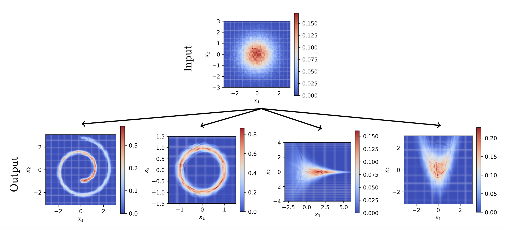

[](https://doi.org/10.48550/arXiv.2412.16385)


# Collisional Optimal Transport

In this repository, we present an implementation of collision-based dynamics for the optimal transport problem. This git repository has been used to produce results in the following paper:

Sadr, Mohsen, and Hossein Gorji. "Collision-based Dynamics for Multi-Marginal Optimal Transport." arXiv preprint at [arXiv:2412.16385 (2024)](https://doi.org/10.48550/arXiv.2412.16385).



## Numpy Implementation
Here, we provide the most accessible (and not fastest) implementation of the collisional OT in NumPy. Simply, first import the library
```
from collision_numpy import collOT_numpy
```
Given the samples are stored in ```X``` with shape 
```(number of marginals, number of samples, dimension of each sample)```
the optimal pairing with the minimum $L2$ cost between marginals can be found via
```
X, log_loss, nt = collOT_numpy(X)
```

## C Implementation
For faster runs on the CPU, we have prepared an implementation in C with a Python wrapper. To use it, first, you need to compile the code. On Linux, it can be done on a terminal simply by

```
cd src/
python3 setup.py build_ext --inplace
```

Then, in the Python code, import the ```collOT_c``` via
```
from collision_wrapper import collOT_c
```
and call the function via something like
```
X, log_loss, nsteps = collOT_c(X, MinIter=100, MaxIter=1000, tol = 1e-6, avg_window=20, Track=1)
```

## PyTorch Implementation
We provide a PyTorch implementation of the collision-based dynamics to solve the 2-marginal optimal transport problem to be used as a loss function in training statistical models. First, import the function via
```
from collision import collOT_pytorch
```
and then call it simply by
```
x, y, log_loss = collOT_pytorch(x, y)
```
Here, ```x``` and ```y``` contain samples of each marginal with shape ```(number of samples, dimension of each sample)```.

For examples of how this implementation can be used, see the Jupyter Notebooks in ```examples/``` directory.
